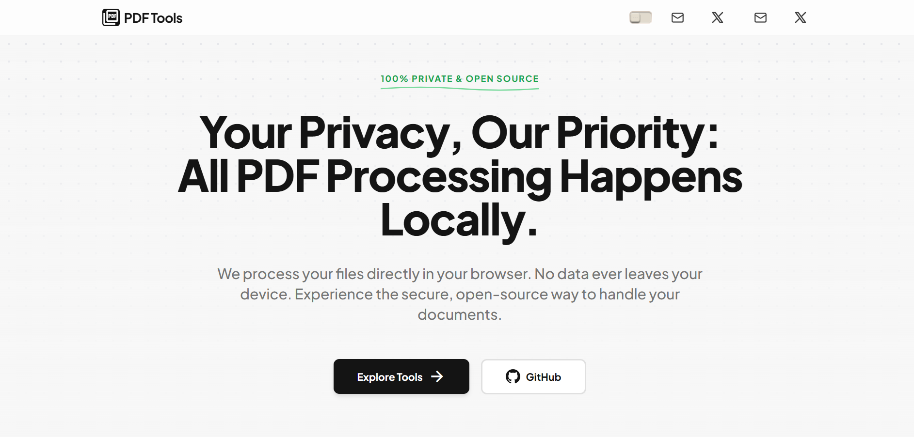

# PDFToolkit

PDFToolkit is a client-side suite of PDF tools built with Next.js. All operations run in the browser to ensure files never leave the user's device.

# PDFToolkit

Live Demo: [xyz.com](https://xyz.com)

## Core Features

* **Local Processing:** All PDF logic runs via client-side JavaScript. This eliminates server latency and keeps sensitive data private.
* **Merge & Split:** Combine multiple documents into one or extract specific pages into new files.
* **Page Manipulation:** Rotate, reorder, or delete individual pages using an interactive drag-and-drop interface.
* **Security Tools:** Add or remove passwords and permissions without sending unencrypted files over the network.
* **Conversion:** Convert images (JPG/PNG) to PDF format instantly.

## Setup and Running

### Installation
1.  **Clone the repo:** `git clone https://github.com/Zintl-e/pdftoolkit.git`
2.  **Enter directory:** `cd pdftoolkit`
3.  **Install dependencies:** `npm install`

### Local Development
* **Start server:** `npm run dev`
* **Access app:** Open `http://localhost:3000` in your browser.

### Production Build
* **Build:** `npm run build`
* **Start:** `npm run start`

## Technical Stack

* **Next.js:** Framework for the user interface and routing.
* **pdf-lib:** Core library used for modifying PDF documents in the browser.
* **Tailwind CSS:** Used for responsive and modern styling.

## Privacy Guarantee

* **No Uploads:** Files are read into browser memory only.
* **No Tracking:** No server logs or analytics are used to store document metadata.
* **Offline Support:** Can be used without an internet connection once the site is loaded.
